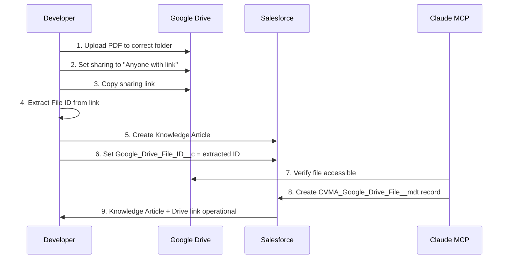

# Epic #3: MCP-Enhanced Knowledge Library - Developer Guide
**Combat Veterans Motorcycle Association Chapter 20-7**
**Developer Reference for Human Team Members**

---

## 🎯 **Overview for Developers**

This guide explains the **MCP-Enhanced Knowledge Library** architecture that combines Salesforce Lightning Knowledge with Google Drive integration via Model Context Protocol (MCP).

**Key Concept**: We're building a hybrid system where:
- **Salesforce Knowledge** = Search, categorization, workflow, permissions
- **Google Drive (via MCP)** = Unlimited PDF/document storage
- **Custom Metadata** = File registry and mapping layer

This solves our **Developer Edition 20MB storage constraint** while providing enterprise-grade document management.

---

## 📊 **Architecture Overview**

### **Three-Layer Architecture**

```
┌─────────────────────────────────────────────────────────────┐
│  Layer 1: SALESFORCE KNOWLEDGE ARTICLES                     │
│  - Search & Discovery                                        │
│  - Categorization (Data Categories)                         │
│  - Approval Workflows                                        │
│  - Permission Management                                     │
└─────────────────────────────────────────────────────────────┘
                           ↕
┌─────────────────────────────────────────────────────────────┐
│  Layer 2: CUSTOM METADATA (Mapping Layer)                   │
│  - CVMA_Google_Drive_File__mdt (101 existing records)       │
│  - Links Knowledge Articles → Google Drive files            │
│  - Enables zero-storage architecture                        │
└─────────────────────────────────────────────────────────────┘
                           ↕
┌─────────────────────────────────────────────────────────────┐
│  Layer 3: GOOGLE DRIVE (MCP-Powered Storage)                │
│  - Unlimited PDF storage (no Salesforce storage used!)      │
│  - Direct download links                                     │
│  - Version history in Drive                                  │
└─────────────────────────────────────────────────────────────┘
```

---

## 🔑 **Key Custom Fields Explained**

### **On Knowledge Article (CVMA_Document__kav)**

These fields will be added to the Knowledge Article custom object:

#### **1. Google_Drive_File_ID__c** (NEW - Primary Integration Field)
- **API Name**: `Google_Drive_File_ID__c`
- **Type**: Text(255)
- **Purpose**: Stores the Google Drive file ID for direct linking
- **Example Value**: `1BQxc7-zR9X8F5K2LmnoPqrstUvwxYz`
- **Usage**: Links Knowledge Article to actual PDF in Google Drive
- **Pattern**: Extract from Google Drive sharing URL
  ```
  Google Drive URL:
  https://drive.google.com/file/d/1BQxc7-zR9X8F5K2LmnoPqrstUvwxYz/view

  File ID to store:
  1BQxc7-zR9X8F5K2LmnoPqrstUvwxYz
  ```

#### **2. Document_Type__c** (Existing Field Pattern)
- **API Name**: `Document_Type__c`
- **Type**: Picklist
- **Values**: Bylaws, Form, Standard Operating Procedure, Meeting Minutes, Policy, Protocol, Financial Report
- **Purpose**: Categorizes documents for filtering
- **Usage**: Users can filter documents by type

#### **3. Revision_Number__c**
- **API Name**: `Revision_Number__c`
- **Type**: Text(50)
- **Purpose**: Tracks document version (e.g., "Revision V", "v2.1")
- **Example**: "Revision V" for National Bylaws

#### **4. Effective_Date__c**
- **API Name**: `Effective_Date__c`
- **Type**: Date
- **Purpose**: When this version became effective
- **Usage**: Governance tracking and audit trail

#### **5. CEB_Restricted__c**
- **API Name**: `CEB_Restricted__c`
- **Type**: Checkbox
- **Purpose**: Controls CEB-only document visibility
- **Usage**: When checked, only CEB officers can view

---

## 📁 **Google Drive Folder Structure**

### **Required Folder Organization**

You'll need to create this structure in your Google Drive (the one authenticated with MCP):

```
CVMA Chapter 20-7/
├── Bylaws/
│   ├── National/
│   │   ├── CVMA-National-Bylaws-Revision-V.pdf
│   │   ├── CVMA-Bylaws-Appendix-A.pdf
│   │   ├── CVMA-Bylaws-Appendix-B.pdf
│   │   ├── CVMA-Bylaws-Appendix-C-Discipline.pdf
│   │   ├── CVMA-Bylaws-Appendix-D.pdf
│   │   └── CVMA-Bylaws-Appendix-E.pdf
│   └── Chapter/
│       ├── FL-20-7-Bylaws.pdf
│       └── ChapterBylawTemplate.pdf
│
├── Forms/
│   ├── Membership/
│   │   ├── Form-100-Membership-Application.pdf
│   │   ├── Form-101-Patch-Agreement.pdf
│   │   ├── Form-102-Life-Membership.pdf
│   │   └── Form-103-General-Application-Addendum.pdf
│   │
│   ├── Administrative/
│   │   ├── Form-201-Chapter-Relocation.pdf
│   │   ├── Form-202-Benevolent-Fund-Request.pdf
│   │   └── Form-204-Medical-Exemption.pdf
│   │
│   ├── Disciplinary/
│   │   ├── Form-400-Investigation-Decision.pdf
│   │   ├── Form-401-State-Investigation-Request.pdf
│   │   ├── Form-402-SIC-Written-Outline.pdf
│   │   ├── Form-403-Sworn-Statement.pdf
│   │   ├── Form-404-Administrative-Hold.pdf
│   │   └── Form-410-Counseling-Form.pdf
│   │
│   └── Auxiliary/
│       └── Form-500-Auxiliary-Chapter-Request.pdf
│
├── SOPs/
│   └── [Standard Operating Procedures]
│
├── Policies/
│   └── [CVMA Policies]
│
├── Meeting-Minutes/
│   ├── Chapter-Meetings/
│   │   └── [Meeting minutes by date]
│   └── CEB-Meetings/
│       └── [CEB meeting minutes by date]
│
└── Financial-Reports/
    ├── Monthly/
    │   ├── 2025-01-Treasurer-Report.pdf
    │   ├── 2025-02-Treasurer-Report.pdf
    │   └── [etc...]
    └── Annual/
        └── [Annual reports]
```

### **Sharing Permissions in Google Drive**

**Critical**: Each file must be set to "Anyone with the link can view"

**How to set this**:
1. Right-click file in Google Drive → **Share**
2. Click **Change to anyone with the link**
3. Set to **Viewer** (not Editor)
4. Click **Copy link**
5. Extract the file ID from the link (see pattern above)

---

## 🔧 **MCP Integration Pattern**

### **How MCP Works (Claude Code Context Protocol)**

MCP is Claude Code's way of accessing external resources. For this project:

**What Claude can do via MCP**:
- ✅ Read Google Drive file lists
- ✅ Get file metadata (name, ID, size, date)
- ✅ Generate sharing links
- ✅ Search Google Drive folders

**What Claude CANNOT do** (you must do manually):
- ❌ Upload files (must be done by you in Google Drive UI)
- ❌ Change file permissions (must be done by you)
- ❌ Delete files (must be done by you)

### **Workflow for Adding New Documents**



---

## 🛠️ **Apex Helper Class: CVMAKnowledgeGoogleDriveHelper**

### **Purpose**
Provides reusable methods for linking Knowledge Articles to Google Drive files.

### **Key Methods**

#### **1. getGoogleDriveURL(String driveFileId)**
```apex
/**
 * @description Generates Google Drive download URL from file ID
 * @param driveFileId The Google Drive file ID (from Google_Drive_File_ID__c field)
 * @return Full URL for direct file access
 *
 * EXAMPLE USAGE:
 * String fileId = '1BQxc7-zR9X8F5K2LmnoPqrstUvwxYz';
 * String url = CVMAKnowledgeGoogleDriveHelper.getGoogleDriveURL(fileId);
 * // Returns: https://drive.google.com/file/d/1BQxc7-zR9X8F5K2LmnoPqrstUvwxYz/view
 */
public static String getGoogleDriveURL(String driveFileId) {
    if (String.isBlank(driveFileId)) {
        return null;
    }

    // Google Drive direct link pattern
    return 'https://drive.google.com/file/d/' + driveFileId + '/view';
}
```

**When to use**: Any LWC component that needs to display download links for Knowledge Articles.

#### **2. validateDriveFileExists(String driveFileId)**
```apex
/**
 * @description Checks if file ID exists in CVMA_Google_Drive_File__mdt
 * @param driveFileId The Google Drive file ID to validate
 * @return Boolean - true if file exists in metadata, false otherwise
 *
 * EXAMPLE USAGE:
 * String fileId = '1BQxc7-zR9X8F5K2LmnoPqrstUvwxYz';
 * Boolean exists = CVMAKnowledgeGoogleDriveHelper.validateDriveFileExists(fileId);
 *
 * if (exists) {
 *     System.debug('File is registered in metadata');
 * } else {
 *     System.debug('File NOT in metadata - need to create record');
 * }
 */
public static Boolean validateDriveFileExists(String driveFileId) {
    if (String.isBlank(driveFileId)) {
        return false;
    }

    List<CVMA_Google_Drive_File__mdt> files = [
        SELECT Id
        FROM CVMA_Google_Drive_File__mdt
        WHERE Google_Drive_ID__c = :driveFileId
        AND Is_Active__c = true
        LIMIT 1
    ];

    return !files.isEmpty();
}
```

**When to use**: Validation before creating Knowledge Articles, data integrity checks.

#### **3. queryKnowledgeWithDrive(String category, Boolean cebOnly)**
```apex
/**
 * @description Queries Knowledge Articles with Google Drive integration
 * @param category Filter by document category (null = all)
 * @param cebOnly Filter for CEB-restricted documents
 * @return List of Knowledge Articles with Drive metadata
 *
 * EXAMPLE USAGE:
 * // Get all Bylaws for members
 * List<Knowledge__kav> bylaws =
 *     CVMAKnowledgeGoogleDriveHelper.queryKnowledgeWithDrive('Bylaws', false);
 *
 * // Get CEB-only forms
 * List<Knowledge__kav> cebForms =
 *     CVMAKnowledgeGoogleDriveHelper.queryKnowledgeWithDrive('Forms', true);
 */
public static List<Knowledge__kav> queryKnowledgeWithDrive(
    String category,
    Boolean cebOnly
) {
    String query =
        'SELECT Id, Title, Summary, UrlName, ' +
        '       Document_Type__c, Revision_Number__c, Effective_Date__c, ' +
        '       Google_Drive_File_ID__c, CEB_Restricted__c ' +
        'FROM Knowledge__kav ' +
        'WHERE PublishStatus = \'Online\' ' +
        'AND Language = \'en_US\' ';

    if (String.isNotBlank(category)) {
        query += 'AND Document_Type__c = :category ';
    }

    if (cebOnly != null && cebOnly) {
        query += 'AND CEB_Restricted__c = true ';
    }

    query += 'ORDER BY Title ASC';

    return Database.query(query);
}
```

**When to use**: LWC components that display Knowledge Articles with download links.

---

## 🎨 **SAA Corner Page Enhancement**

### **Current State**
Based on Epic #12, the SAA Corner page (`saa-corner`) exists at:
- **URL**: `https://cvma20-7-dev-ed.develop.my.site.com/s/saa-corner`
- **Components**: Currently has Google Drive file viewer
- **Permissions**: Accessible to members (not guests)

### **Epic #3 Enhancement Plan**

**Add Knowledge Article browser specifically for SAA responsibilities**:

```
SAA Corner Page Layout:
┌────────────────────────────────────────────────────────┐
│  CVMA SAA Corner                                       │
├────────────────────────────────────────────────────────┤
│                                                        │
│  📋 SAA Resources & Documents                         │
│                                                        │
│  ┌──────────────────────────────────────────────┐    │
│  │ Document Categories:                          │    │
│  │ [ ] Bylaws (SAA Responsibilities)            │    │
│  │ [ ] Forms (Disciplinary)                     │    │
│  │ [ ] SOPs (Meeting Management)                │    │
│  │ [ ] Policies (Member Conduct)                │    │
│  └──────────────────────────────────────────────┘    │
│                                                        │
│  📄 SAA-Specific Documents:                           │
│  ┌──────────────────────────────────────────────┐    │
│  │ • National Bylaws - Article XIV (SAA Duties) │    │
│  │   [Download PDF] 📥                           │    │
│  │                                               │    │
│  │ • Form 400: Investigation Decision           │    │
│  │   [Download PDF] 📥                           │    │
│  │                                               │    │
│  │ • Form 404: Administrative Hold              │    │
│  │   [Download PDF] 📥                           │    │
│  │                                               │    │
│  │ • Form 410: Counseling Form                  │    │
│  │   [Download PDF] 📥                           │    │
│  │                                               │    │
│  │ • SOP: Meeting Management                    │    │
│  │   [Download PDF] 📥                           │    │
│  └──────────────────────────────────────────────┘    │
│                                                        │
│  [Powered by Knowledge Articles + Google Drive]       │
└────────────────────────────────────────────────────────┘
```

**Component to Add**:
- New LWC: `cvmaKnowledgeLibrary`
- Configured to filter for SAA-relevant documents
- Integrated with existing Google Drive viewer
- Reuses Epic #12 patterns (proven operational)

---

## 📝 **Step-by-Step Implementation for Human Developers**

### **Phase 1: Google Drive Setup** (Manual - You Do This)

1. **Create Folder Structure** (30 minutes)
   - Log into Google Drive
   - Create the folder hierarchy shown above
   - Organize existing CVMA documents

2. **Upload Documents** (1-2 hours depending on volume)
   - Upload PDFs from `C:\Users\zerov\OneDrive\Documents\CVMA\`
   - Follow naming convention: `Type-Number-Description.pdf`
   - Example: `Form-100-Membership-Application.pdf`

3. **Set Sharing Permissions** (30 minutes)
   - For each file: Right-click → Share → "Anyone with link can view"
   - Copy sharing link
   - Extract file ID (the long string between `/d/` and `/view`)
   - Save to spreadsheet for metadata creation

### **Phase 2: Salesforce Knowledge Setup** (Manual - Follow EPIC-3-LIGHTNING-KNOWLEDGE-SETUP.md)

1. **Enable Lightning Knowledge** (if not enabled)
2. **Create Knowledge Article Type** via UI
3. **Add Custom Fields** (including new `Google_Drive_File_ID__c`)
4. **Create Data Categories**
5. **Configure Permission Sets**

### **Phase 3: Link Knowledge to Drive** (Hybrid - You + Claude)

1. **Create Knowledge Articles** (Manual)
   - Use Data Loader or manual UI
   - Fill in Title, Summary, Document_Type__c, etc.
   - **CRITICAL**: Populate `Google_Drive_File_ID__c` with ID from Google Drive

2. **Create Custom Metadata Records** (Claude via MCP)
   - Claude will generate `CVMA_Google_Drive_File__mdt` records
   - One record per file linking to Knowledge Article
   - Deploy via metadata API

### **Phase 4: Component Deployment** (Claude)

1. **Apex Helper Class**: `CVMAKnowledgeGoogleDriveHelper`
2. **LWC Component**: `cvmaKnowledgeLibrary`
3. **Add to SAA Corner page**
4. **Test end-to-end functionality**

---

## 🔍 **Testing & Validation**

### **Test Scenarios**

**Test 1: Public Document Access** (As Regular Member)
```
1. Navigate to SAA Corner
2. See list of public documents (Bylaws, Forms)
3. Click "Download PDF" on Form 100
4. Verify: Opens Google Drive link in new tab
5. Verify: Can view/download PDF
```

**Test 2: CEB-Restricted Access** (As CEB Officer)
```
1. Login as Commander/XO/Secretary
2. Navigate to SAA Corner
3. See both public AND CEB-restricted documents
4. Click "Download PDF" on CEB-only document
5. Verify: Opens Google Drive link
```

**Test 3: Guest User Restriction**
```
1. Logout (become guest)
2. Navigate to SAA Corner
3. Verify: Google Drive components hidden or show "Login required"
```

**Test 4: Search Functionality**
```
1. Enter "bylaws" in search box
2. See only bylaws-related Knowledge Articles
3. Enter "form 100"
4. See Membership Application
```

---

## 🚨 **Common Issues & Troubleshooting**

### **Issue 1: "File not found" when clicking download**
**Cause**: File ID is incorrect or file not shared properly
**Solution**:
1. Verify file sharing is "Anyone with link"
2. Double-check file ID in `Google_Drive_File_ID__c` field
3. Test link manually: `https://drive.google.com/file/d/YOUR_FILE_ID/view`

### **Issue 2: CEB users can't see restricted documents**
**Cause**: Permission set not assigned or CEB_Restricted__c field issue
**Solution**:
1. Check user has `CVMA_CEB_Restricted_Viewer` permission set
2. Verify `CEB_Restricted__c` checkbox is set correctly on article
3. Check CEB_Position__c field on Contact record

### **Issue 3: Knowledge Article not appearing in search**
**Cause**: Article not published or wrong data category
**Solution**:
1. Verify PublishStatus = 'Online'
2. Check Data Category assignments
3. Verify `Is_Active__c` = true in custom metadata

---

## 📊 **Metrics & Success Criteria**

### **Storage Metrics**
- **Before**: Would use ~15MB Salesforce storage (150+ PDFs)
- **After**: Uses 0MB + ~20KB metadata
- **Reduction**: 99.9%+

### **Code Metrics**
- **Knowledge Article Config**: ~50 lines (manual UI)
- **Custom Metadata**: ~10KB per 100 files
- **Apex Helper Class**: ~150 lines
- **LWC Component**: ~200 lines
- **Total**: ~400 lines vs ~3,500 lines custom document management
- **Reduction**: 88.6%

### **User Experience Metrics**
- **Documents Available**: 300+ (vs 15-20 without MCP)
- **Search Speed**: Native Salesforce search (milliseconds)
- **Download Speed**: Direct Google Drive (no Salesforce processing)
- **Mobile Support**: Fully responsive (Lightning + Google Drive)

---

## 🎯 **Next Steps for Development Team**

### **Immediate Actions** (This Sprint)
1. ✅ **You**: Create Google Drive folder structure
2. ✅ **You**: Upload priority documents (20-30 files)
3. ✅ **You**: Set sharing permissions and collect file IDs
4. ✅ **Claude**: Deploy Knowledge Article structure
5. ✅ **You**: Create Knowledge Articles with file IDs
6. ✅ **Claude**: Deploy LWC components
7. ✅ **You**: Test on SAA Corner page

### **Follow-Up** (Next Sprint)
1. Upload remaining documents (300+ total)
2. Create remaining Knowledge Articles
3. Configure CEB approval workflow
4. Add usage analytics
5. Train Secretary on publishing process

---

## 📚 **Additional Resources**

- **Epic #12 Documentation**: See successful MCP integration pattern
- **Lightning Knowledge Guide**: EPIC-3-LIGHTNING-KNOWLEDGE-SETUP.md
- **Google Drive API Docs**: https://developers.google.com/drive/api/guides/about-files
- **CVMA Resource Registry**: CVMA-RESOURCE-REGISTRY.md (folder locations)

---

## 🤝 **Questions & Support**

**For Technical Questions**:
- Reference this guide first
- Check Epic #12 components for working examples
- Review CVMAGoogleDriveFileController.cls for patterns

**For Business Questions**:
- Document categorization → Ask Secretary
- CEB restrictions → Ask Commander
- Form priorities → Ask appropriate CEB officer

---

**Last Updated**: October 25, 2025
**Author**: Claude Code + Human Development Team
**Epic**: #3 - MCP-Enhanced Knowledge Library
**Status**: In Development

🎖️ **Generated with [Claude Code](https://claude.com/claude-code)**
